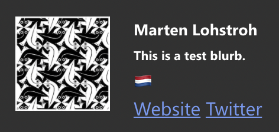

# Lingua Franca Website

This a pretty traditional Gatsby site. You can start it up via:

```sh
yarn start
```

Which starts up a dev server that automatically displays local changes while running.

## Generic Pages

To add generic pages (i.e. Adding a page not tied directly to the handbook section of documentation), do the following:
1. Navigate to the pages directory under ```src/templates/pages```
2. Create a .tsx file named EXAMPLE.tsx. This will be rendered as a page at the link lf-lang.org/EXAMPLE
    - For nested directory structures, create a folder structure similar to docs (i.e. the index.tsx under docs/handbook/index.tsx) will be rendered at [lf-lang.org/docs/handbook]()
    - Adding a page requires the use of embedded HTML (feel free to look at any of the pages for an example use case). What may be useful is to use a [Markdown to HTML Converter](https://markdowntohtml.com/) to expedite this process.
3. *OPTIONAL*: You can define a custom css files by defining a .scss file under the css folder, which can easily be referenced in your page file.

## Handbook Pages

Information on adding pages to specifically the documentation handbook are addressed in the handbook package's README. **And where is that?**

## Adding Contributors

To add contributors to the community page for Lingua Franca, do the following steps:
1. Navigate to ```src/templates/pages/community.tsx```
2. Near the top of the file is the following set of key-value map pairs:
```
const contributors = [
  ...
  {
    name: "Marten Lohstroh",
    url: "http://people.eecs.berkeley.edu/~marten/",
    image: "https://avatars.githubusercontent.com/u/19938940?v=4",
    twitter: "https://twitter.com/martenlohstroh",
    country: "🇳🇱",
    continentish: "North America",
    blurb: "This is a test blurb.",
  },
  ...
]
```
3. Add another entry to the map with the information you want to include (need at minimum name, image, and url) but can also optionally include other attributes like twitter, country flag, and a short blurb!

The example for Marten's community render looks like this:




